<div align="center">


<br/>

<a href="https://www.linkedin.com/in/aditya-upadhyay-69161a328/">
  
</a>
<a href="mailto:chahatupadhyay2006@gmail.com">
  
</a>
<a href="https://github.com/UP-Aditya">
  
</a>
<a href="https://codeforces.com/profile/chahat">
  
</a>
<a href="https://www.codechef.com/users/adityaa_up62">
  
</a>
<a href="https://leetcode.com/__chahat">
  
</a>
<a href="https://atcoder.jp/users/chahat_">
  
</a>
<a href="https://codolio.com/profile/aditya_up62">
  
</a>

<br/><br/>


</div>

---

## `~/` whoami

```console
$ whoami
aditya@github:~$ ./about.sh
```

> Computer Science undergraduate with a strong foundation in **Data Structures, Algorithms, Backend Development, and DevOps**.
>
> I spend my time solving algorithmic problems, building backend systems, and automating infrastructure so machines can do the boring stuff for me.

### `> currently_running`

* 🔭 Building **a secure, automated DevSecOps CI/CD pipeline**
* 🌱 Learning **Kubernetes, AWS, Terraform & Distributed Systems**
* 🧠 Practicing **Competitive Programming & Advanced DSA**
* ☁️ Exploring **Cloud Infrastructure & Platform Engineering**
* ⚡ Fun fact: Cleared the **UPSC NDA written examination twice**
* ☕ Current dependency: `coffee + music + terminal`

---

## `~/` toolbox

<div align="center">


<br/><br/>


</div>

<details>
<summary><b>⚙️ More tools under the hood</b></summary>

<br/>

`Prisma` `Supabase` `Vercel` `Netlify` `NumPy` `Pandas` `Scikit-Learn`
`TensorFlow` `OpenCV` `Arduino` `ESP32` `Raspberry Pi` `Bash` `SQL`

</details>

---

## `~/` competitive programming

<div align="center">

| Platform      | Profile                                                      |
| ------------- | ------------------------------------------------------------ |
| 🟣 Codeforces | [@chahat](https://codeforces.com/profile/chahat)             |
| 🟤 CodeChef   | [@adityaa_up62](https://www.codechef.com/users/adityaa_up62) |
| 🟠 LeetCode   | [@__chahat](https://leetcode.com/__chahat)                   |
| 🔵 AtCoder    | [@chahat_](https://atcoder.jp/users/chahat_)                 |
| 🟪 Codolio    | [@aditya_up62](https://codolio.com/profile/aditya_up62)      |

</div>

```text
Problems solved     : 1800+
Rated contests      : 150+
Primary language    : C++
Current obsession   : DP → Graphs → Greedy → Everything
```

---

## `~/` featured projects

<table>
<tr>

<td width="50%" valign="top">

### 🚀 Secure DevSecOps CI/CD Pipeline

A production-style CI/CD pipeline with automated security and policy checks.

**Highlights**

* Automated CI/CD workflow
* Static code analysis
* Policy-as-code enforcement
* Dockerized deployment flow
* AWS integration

`GitHub Actions` `Docker` `AWS`
`SonarQube` `OPA` `Conftest`

<a href="https://github.com/UP-Aditya/devops-cicd-security-platform">

</a>

</td>

<td width="50%" valign="top">

### 🤖 codeforces_mine

An automation pipeline that automatically pushes solved Codeforces problems to GitHub.

**Highlights**

* Codeforces API integration
* Automatic problem organization
* Scheduled uploads
* Progress tracking
* Reusable automation setup

`Python` `Codeforces API` `Automation`
`GitHub` `Scheduling`

<a href="https://github.com/UP-Aditya/codeforces_mine">

</a>

</td>

</tr>
</table>

---

## `~/` GitHub activity

<div align="center">

<div align="center">






</div>

</div>

---


## `~/` contribution snake

<div align="center">

<picture>
  <source
    media="(prefers-color-scheme: dark)"
    srcset="https://raw.githubusercontent.com/UP-Aditya/UP-Aditya/output/github-contribution-grid-snake-dark.svg"
  />

  <source
    media="(prefers-color-scheme: light)"
    srcset="https://raw.githubusercontent.com/UP-Aditya/UP-Aditya/output/github-contribution-grid-snake.svg"
  />

  

</picture>

</div>

---

## `~/` random developer wisdom

<div align="center">


</div>

---

## `~/` activity monitor

```text
┌──────────────────────────────────────────────┐
│                 SYSTEM STATUS                │
├──────────────────────────────────────────────┤
│ DSA Practice        ███████████████░  ACTIVE │
│ Competitive Coding  ██████████████░░  ACTIVE │
│ DevOps              ███████████████░  ACTIVE │
│ Kubernetes           ████████░░░░░░░  LEARN  │
│ Terraform            ███████░░░░░░░░  LEARN  │
│ Backend Engineering  ██████████████░░  ACTIVE │
└──────────────────────────────────────────────┘
```

---

## `~/` let's connect

<div align="center">

<a href="https://github.com/UP-Aditya">

</a>

<a href="https://www.linkedin.com/in/aditya-upadhyay-69161a328/">

</a>

<a href="mailto:chahatupadhyay2006@gmail.com">

</a>

<br/><br/>

```text
while(alive) {
    solve();
    build();
    automate();
    repeat();
}
```

</div>

---

<div align="center">


</div>
